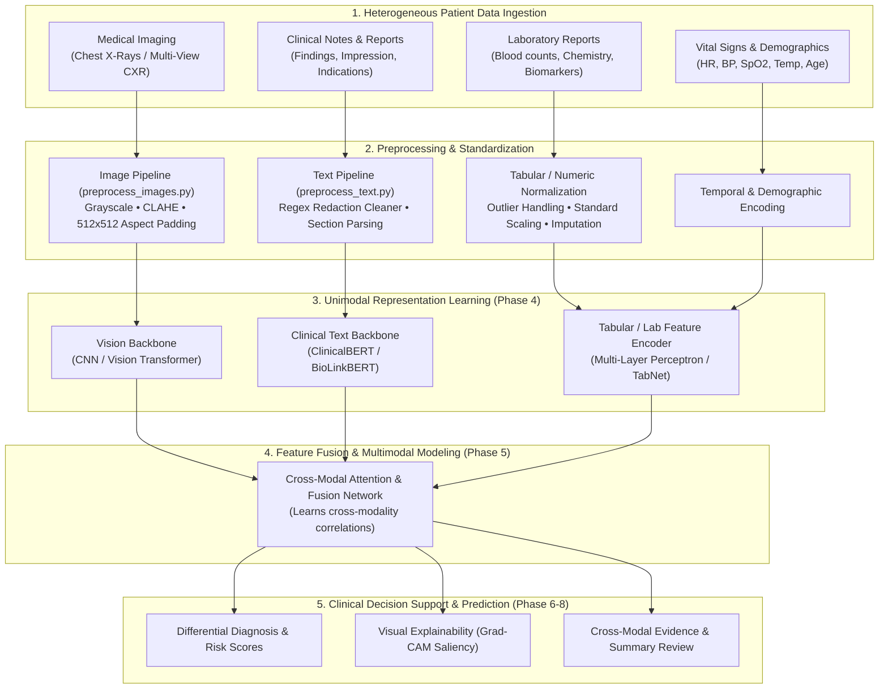

# Multimodal Clinical Decision Support System (CDSS)
### *An AI-Assisted Multimodal Medical Record Analysis Platform*

[](https://www.python.org/)
[](https://opencv.org/)
[](https://pandas.pydata.org/)
[]()
[]()

---

## Table of Contents

- [Executive Summary](#executive-summary)
- [System Architecture & Modality Overview](#system-architecture--modality-overview)
- [Core Design Principles](#core-design-principles)
- [Project Lifecycle & 9-Phase Timeline](#project-lifecycle--9-phase-timeline)
- [Current Implementation (Phase 3: Preprocessing Pipeline)](#current-implementation-phase-3-preprocessing-pipeline)
  - [1. Medical Imaging Preprocessing](#1-medical-imaging-preprocessing)
  - [2. Clinical Text & Report Preprocessing](#2-clinical-text--report-preprocessing)
  - [3. Laboratory & Vital Sign Modalities](#3-laboratory--vital-sign-modalities)
  - [4. Multimodal Alignment & Dataset Structuring](#4-multimodal-alignment--dataset-structuring)
- [Dataset Specifications & Schema](#dataset-specifications--schema)
- [Repository Structure](#repository-structure)
- [Installation & Setup](#installation--setup)
- [Pipeline Execution & Usage](#pipeline-execution--usage)
- [Ethical Considerations & Clinical Disclaimer](#ethical-considerations--clinical-disclaimer)
- [References & Acknowledgments](#references--acknowledgments)

---

## Executive Summary

Modern healthcare environments require clinicians to interpret large volumes of heterogeneous patient records under tight time constraints. A single patient case often encompasses diagnostic medical imaging, laboratory panels, time-series vital signs, and unstructured clinical narratives. Synthesizing these disparate data streams manually increases cognitive workload and the potential for oversight.

The **Multimodal Clinical Decision Support System (CDSS)** is an AI-driven medical record analysis system designed to integrate diverse patient data modalities—including **medical images, laboratory reports, vital signs, and clinical notes**. 

By leveraging **multimodal deep learning and feature fusion**, the system correlates findings across modalities to generate a holistic, evidence-based understanding of a patient’s condition. 

> [!IMPORTANT]
> **Clinical Objective**: The primary goal is to **assist healthcare professionals** in reviewing and interpreting complex patient records efficiently, rather than replacing clinical decision-making. The system provides supportive, evidence-based insights, flagging cross-modal patterns to help clinicians make faster, better-informed diagnostic decisions while reducing chart review fatigue.

---

## System Architecture & Modality Overview

The platform uses a modular multimodal pipeline where unimodal feature extractors feed into a centralized cross-modal fusion engine:



---

## Core Design Principles

```
+---------------------------------------------------------------------------------------------+
|                                     Core System Principles                                  |
+---------------------------------------------------------------------------------------------+
| 1. Clinician-in-the-Loop          : Assistive second-opinion tool; never replaces doctors   |
| 2. Anatomical Laterality Safety   : No horizontal flipping to preserve spatial pathology    |
| 3. High-Fidelity Preprocessing    : CLAHE contrast enhancement without noise distortion     |
| 4. Semantic Redaction Restoration : Context-aware regex cleaning of de-identified text      |
| 5. Evidence-Based Interpretability: Visual heatmaps & feature attribution across modalities |
+---------------------------------------------------------------------------------------------+
```

1. **Clinician-in-the-Loop Assistive Design**: The system does not act as a black-box decision maker. It outputs structured confidence scores, highlights relevant findings, and presents multi-modal evidence for physician review.
2. **Anatomical Laterality Safety**: During image preprocessing and augmentation, horizontal flips are strictly avoided. Organ positions (e.g., cardiac apex, aortic knob, gastric bubble) are orientation-dependent; flipping introduces medical inaccuracies (e.g., false dextrocardia).
3. **Contrast-Limited Adaptive Histogram Equalization (CLAHE)**: Radiographs often present uneven dynamic ranges between dense mediastinal bone and air-filled lung parenchyma. CLAHE (`clipLimit=2.0`, `tileGridSize=(8, 8)`) elevates subtle local contrast without amplifying background noise artifacts.
4. **Aspect-Ratio Preserved Resizing**: Rescaling directly without preserving aspect ratios distorts organ geometry and cardiothoracic ratios. Images are scaled uniformly and padded with black borders (`cv2.BORDER_CONSTANT`) into standard $512 \times 512$ dimensions.
5. **Context-Aware De-Identification Restoration**: Raw reports contain clinical de-identification tokens (`XXXX`). A specialized regex engine reconstructs grammatical fluency (e.g., converting `XXXX-year-old` to `[Age]-year-old`, `dated XXXX` to `dated [Date]`) so language models receive clean semantic structure.

---

## Project Lifecycle & 9-Phase Timeline

The project follows a structured 9-month development lifecycle:

| Phase | Timeline | Key Activities & Objectives | Core Deliverables | Status |
| :--- | :--- | :--- | :--- | :---: |
| **Phase 1: Problem Definition & Research** | **July** | Literature survey, research gap identification, multimodal architecture analysis, clinical requirements definition | Project Proposal & Requirements Spec | Completed |
| **Phase 2: Dataset Collection & Analysis** | **August** | Dataset identification (Indiana CXR, clinical narratives, clinical parameters), format exploration, ingestion strategy | Curated Raw Datasets | Completed |
| **Phase 3: Data Preprocessing Pipeline** | **September** | Image standardization (CLAHE, 512x512 padding), regex text de-identification cleaning, multimodal alignment, train/val/test splits | Clean, Ready-to-Use Multimodal Dataset | **Current Phase** |
| **Phase 4: Individual Modal Models** | **October** | Develop unimodal feature extractors: Image (CNN/ViT), Text (ClinicalBERT/BioBERT), Tabular Labs/Vitals; unimodal baseline evaluation | Validated Unimodal Feature Extractors | Upcoming |
| **Phase 5: Feature Fusion Module** | **November** | Design multimodal fusion architecture (cross-attention, tensor fusion, concatenation), learn inter-modal relationships | Functional Multimodal Model | Upcoming |
| **Phase 6: Prediction & Decision Support** | **December** | Multi-task disease classification, clinical risk prediction, report cross-verification, confidence score calibration | Clinical Prediction Engine | Upcoming |
| **Phase 7: Testing & Performance Evaluation** | **January** | Comprehensive evaluation (AUROC, F1, sensitivity/specificity), ablation studies vs. unimodal baselines, robustness testing | Experimental Benchmark Report | Upcoming |
| **Phase 8: User Interface & Integration** | **February** | Interactive clinical dashboard development, backend model serving, clinician workflow validation | Integrated Doctor Assistance Web App | Upcoming |
| **Phase 9: Documentation & Deployment** | **March** | Technical documentation, final project report, user guide, production containerization/deployment | Complete Production Deliverable | Upcoming |

---

## Current Implementation (Phase 3: Preprocessing Pipeline)

The repository currently implements the complete data engineering and preprocessing foundation for paired medical imaging and clinical reports.

### 1. Medical Imaging Preprocessing
Implemented in [`src/preprocess_images.py`](file:///c:/Users/Adhithiee/Desktop/Final%20Year%20Project/Multimodal-Clinical-Decision-Support-System/Multimodal%20Clinical%20Decision%20Support%20System/src/preprocess_images.py):
- **Grayscale Verification**: Ensures valid 8-bit single-channel input.
- **CLAHE Enhancement**: Applies adaptive local histogram equalization with `clipLimit=2.0` and `(8, 8)` tile grids.
- **Aspect-Ratio Preserved Resizing**: Calculates scaling factor $\text{scale} = \min(\frac{512}{w}, \frac{512}{h})$ and applies symmetric constant black padding.

```python
from src.preprocess_images import preprocess_single_image

# Process an individual radiograph
preprocess_single_image(
    img_path="images/images_normalized/1_IM-0001-4001.dcm.png",
    output_path="images/images_processed/1_IM-0001-4001.dcm.png",
    target_size=(512, 512)
)
```

### 2. Clinical Text & Report Preprocessing
Implemented in [`src/preprocess_text.py`](file:///c:/Users/Adhithiee/Desktop/Final%20Year%20Project/Multimodal-Clinical-Decision-Support-System/Multimodal%20Clinical%20Decision%20Support%20System/src/preprocess_text.py):
- **Semantic Token Transformation**:
  - `\bXXXX\s*-\s*year\s*-\s*old\b` $\rightarrow$ `[Age]-year-old`
  - `\b(dated|date of|on|from)\s+XXXX\b` $\rightarrow$ `\1 [Date]`
  - `\b(at|around)\s+XXXX\s+(hours|hrs)\b` $\rightarrow$ `\1 [Time]`
- **Syntactic Cleaning**: Removes stray punctuation, double commas, and orphaned `XXXX` tags.
- **Section Parsing**: Extracts structured `Indication`, `Findings`, `Impression`, and `MeSH` terms.

### 3. Laboratory & Vital Sign Modalities
- Preprocessing modules for structured tabular parameters (e.g., blood pressure, heart rate, oxygen saturation, temperature, laboratory blood counts, and metabolic indicators) standardize numeric ranges, impute missing entries, and create tabular feature vectors ready for the Phase 4/5 fusion layers.

### 4. Multimodal Alignment & Dataset Structuring
Implemented in [`src/run_preprocessing.py`](file:///c:/Users/Adhithiee/Desktop/Final%20Year%20Project/Multimodal-Clinical-Decision-Support-System/Multimodal%20Clinical%20Decision%20Support%20System/src/run_preprocessing.py):
- Links patient IDs (`uid`) across report records and multi-view projections (Frontal PA/AP and Lateral).
- Filters missing/corrupted files to guarantee dataset integrity.
- Exports the synchronized index file [`processed_dataset.csv`](file:///c:/Users/Adhithiee/Desktop/Final%20Year%20Project/Multimodal-Clinical-Decision-Support-System/Multimodal%20Clinical%20Decision%20Support%20System/processed_dataset.csv) (3,851 fully aligned multimodal cases).

---

## Dataset Specifications & Schema

### Dataset Overview (Indiana University CXR & Reports)
- **Source**: National Library of Medicine (NLM), National Institutes of Health (NIH) OpenI Collection.
- **Total Aligned Patient Records**: 3,851 cases.
- **Frontal View Radiographs**: 3,689 linked cases.
- **Lateral View Radiographs**: 3,550 linked cases.

### Aligned Data Schema (`processed_dataset.csv`)

| Column Name | Data Type | Description | Example / Content |
| :--- | :--- | :--- | :--- |
| `uid` | `int64` | Unique patient encounter identifier | `1`, `2`, `3850` |
| `findings` | `string` | Cleaned detailed radiological observations | *"Lungs are clear bilaterally. No focal consolidation or effusion."* |
| `impression` | `string` | Radiologist's diagnostic summary / conclusion | *"No acute cardiopulmonary abnormality."* |
| `indication` | `string` | Clinical reason for study and patient history | *"Dyspnea, chest pain for 3 days."* |
| `mesh` | `string` | Standardized Medical Subject Headings codes | `normal`, `Cardiomegaly/borderline` |
| `problems` | `string` | High-level clinical problem tags | `normal`, `Atelectasis` |
| `frontal_images` | `string` | Semicolon-delimited relative paths to preprocessed frontal X-rays | `images/processed/1_IM-0001-4001.dcm.png` |
| `lateral_images` | `string` | Semicolon-delimited relative paths to preprocessed lateral X-rays | `images/processed/1_IM-0001-3001.dcm.png` |

---

## Repository Structure

```text
Multimodal Clinical Decision Support System/
├── indiana_reports.csv            # Raw radiology reports and diagnostic metadata
├── indiana_projections.csv        # Projection view mapping (Frontal PA/AP, Lateral)
├── processed_dataset.csv          # Master aligned multimodal dataset (3,851 rows)
├── requirements.txt               # Python package dependencies
├── README.md                      # Comprehensive project documentation
│
├── images/
│   ├── images_normalized/         # Raw source radiographs (~7,470 PNGs)
│   └── images_processed/          # Preprocessed 512x512 CLAHE-enhanced radiographs
│
├── src/
│   ├── preprocess_images.py       # CLAHE enhancement and aspect-ratio padding module
│   ├── preprocess_text.py         # Regex de-identification cleaning and text parser
│   └── run_preprocessing.py       # Master multimodal orchestration pipeline
│
└── documentation/
    ├── implementation_plan.md     # Engineering plan and technical specifications
    └── implementation_guide.md    # Step-by-step pipeline walkthrough
```

---

## Installation & Setup

### Prerequisites
- Python **3.9+** (recommended: 3.10 - 3.12)
- Git & Virtual Environment manager (`venv` or `conda`)

### Step 1: Create & Activate Virtual Environment

**Windows (PowerShell):**
```powershell
python -m venv env
.\env\Scripts\Activate.ps1
```

**Linux / macOS:**
```bash
python3 -m venv env
source env/bin/activate
```

### Step 2: Install Dependencies
```bash
pip install -r requirements.txt
```

---

## Pipeline Execution & Usage

### Running the End-to-End Preprocessing Pipeline
To execute the text cleaning, image enhancement, and multi-view alignment:

```bash
python src/run_preprocessing.py
```

### Visual Verification of Contrast Enhancement
To inspect the effect of CLAHE enhancement side-by-side with original radiographs:

```python
import os
import cv2
import matplotlib.pyplot as plt

raw_path = "images/images_normalized/1_IM-0001-4001.dcm.png"
proc_path = "images/images_processed/1_IM-0001-4001.dcm.png"

if os.path.exists(raw_path) and os.path.exists(proc_path):
    img_raw = cv2.imread(raw_path, cv2.IMREAD_GRAYSCALE)
    img_proc = cv2.imread(proc_path, cv2.IMREAD_GRAYSCALE)

    fig, axes = plt.subplots(1, 2, figsize=(10, 5))
    axes[0].imshow(img_raw, cmap="gray")
    axes[0].set_title("Original Radiograph")
    axes[0].axis("off")

    axes[1].imshow(img_proc, cmap="gray")
    axes[1].set_title("CLAHE Preprocessed (512x512)")
    axes[1].axis("off")

    plt.tight_layout()
    plt.show()
```

---

## Ethical Considerations & Clinical Disclaimer

> [!CAUTION]
> **Assistive Research Disclaimer**:
> This software is being developed exclusively for **academic research and clinical decision support demonstration**. It is **not** an autonomous diagnostic device, nor is it certified to replace the clinical judgment of licensed physicians, radiologists, or healthcare specialists.
>
> All generated insights, risk assessments, and model outputs must be validated by qualified medical professionals.

---

## References & Acknowledgments

1. **Indiana University Chest X-Ray Collection**:
   - Demner-Fushman, D., et al. (2016). *Preparing a collection of radiology examinations for distribution and retrieval*. Journal of the American Medical Informatics Association (JAMIA), 23(2), 304–310. [doi:10.1093/jamia/ocv080](https://doi.org/10.1093/jamia/ocv080).
2. **OpenI Biomedical Image Repository**:
   - National Library of Medicine (NLM), National Institutes of Health (NIH). [https://openi.nlm.nih.gov/](https://openi.nlm.nih.gov/)
3. **Contrast-Limited Adaptive Histogram Equalization**:
   - Pizer, S. M., et al. (1987). *Adaptive histogram equalization and its variations*. Computer Vision, Graphics, and Image Processing, 39(3), 355–368.
